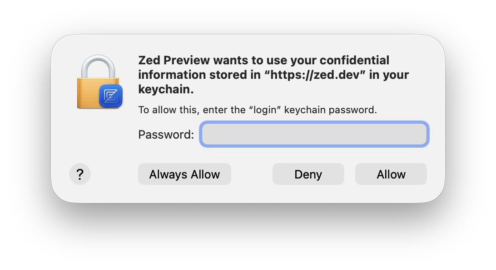

# zed-yolo-hook: Quickstart

> Date: 2026-02-27
> Target: Zed Preview + Zed Stable (macOS aarch64)

---

## Prerequisites

- macOS on Apple Silicon (aarch64)
- Rust toolchain per `rust-toolchain.toml` (nightly)
- Xcode Command Line Tools (for `codesign`, `otool`)
- Zed installed at one of:
  - `/Applications/Zed Preview.app`
  - `/Applications/Zed.app`

---

## 1. Build + Inject

This repo includes an `xtask` patcher exposed via a Cargo alias.

Patch Zed Preview (default):

```bash
cd /path/to/zed-yolo-hook
cargo patch
```

Patch Zed Stable:

```bash
cargo patch --stable
```

Patch a custom app path (useful if `/Applications` is not writable):

```bash
cargo patch --zed-app "/path/to/Zed Preview.app"
```

What it does:

1. Builds `libzed_yolo_hook.dylib` (unless you pass `--dylib`)
2. Installs `insert-dylib` into `target/tools` (first run only)
3. Backs up `.../Contents/MacOS/zed` to `.../Contents/MacOS/zed.original`
4. Injects the dylib load command
5. Re-signs the app bundle (ad-hoc)
6. Verifies injection via `otool -L`

---

## 2. Verify

Watch the hook log:

```bash
tail -f ~/Library/Logs/Zed/zed-yolo-hook.*.log
```

You should see something like:

- `=== zed-yolo-hook vX.Y.Z ===`
- `permission_decision: hook installed` (only in allow-all mode)
- `tool_authorization: hook installed`
- `YOLO mode ACTIVE`

Example: agent tool call proceeds without the approval dialog:


For reference, the dialog this project bypasses:


---

## 3. Disable Without Restoring

Launch Zed with YOLO disabled:

```bash
ZED_YOLO_MODE=0 open "/Applications/Zed Preview.app"
```

Modes:

- `ZED_YOLO_MODE` unset: enable hooks (default)
- `ZED_YOLO_MODE=allow_safe`: only auto-approve ACP dialogs; native permissions remain governed by Zed settings
- `ZED_YOLO_MODE=0|off|disabled`: dylib loads but installs no hooks

---

## 4. Restore

Restore the original binary from the `.original` backup and re-sign:

```bash
cargo patch restore           # Zed Preview
cargo patch restore --stable  # Zed Stable
```

---

## Troubleshooting

### "Permission" or write failures

If patching fails due to filesystem permissions on `/Applications`, copy the app bundle to a user-writable location and patch via `--zed-app`.

### Keychain prompts / access issues

After patching and re-signing, macOS may show additional prompts the first time Zed (or plugins) access protected resources.


