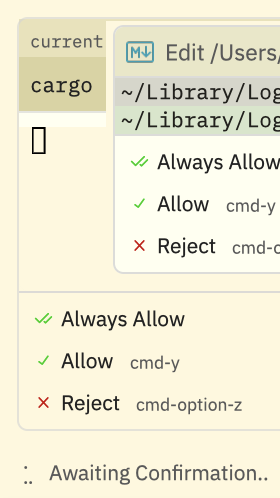

# YOLO Mode Research: Auto-Approving Tool Calls in Zed Preview

> Date: 2026-02-26
> Scope: Zed Preview macOS (arm64), Claude Agent via ACP, no source rebuild
> Goal: Eliminate the "Always Allow / Allow / Reject" approval dialog for external agents

---

## Table of Contents

1. [Problem Statement](#1-problem-statement)
2. [Zed's Tool Permission Architecture](#2-zeds-tool-permission-architecture)
3. [Why Settings Alone Are Insufficient](#3-why-settings-alone-are-insufficient)
4. [Source Code Analysis: The Hook Target](#4-source-code-analysis-the-hook-target)
5. [ACP Permission Protocol Flow](#5-acp-permission-protocol-flow)
6. [Lessons Learned: `#[ctor]` and Child Process Proliferation](#6-lessons-learned-ctor-and-child-process-proliferation)
7. [Lessons Learned: Keystroke Simulation Is Impossible (v0.4–v0.6)](#7-lessons-learned-keystroke-simulation-is-impossible-v04v06)
8. [Lessons Learned: Native Permission Hook Is Wrong Target (v0.7)](#8-lessons-learned-native-permission-hook-is-wrong-target-v07)
9. [Hooking Strategy: Replace `request_tool_call_authorization` (v0.8)](#9-hooking-strategy-replace-request_tool_call_authorization-v08)
10. [References](#10-references)

---

## 1. Problem Statement

When running Claude Agent (or any ACP-based agent) in Zed's Agent Panel, **every tool call** triggers an approval dialog with three options:

- **Always Allow** (cmd-y) — sets `tool_permissions.tools.<tool>.default = "allow"` in settings.json
- **Allow** (cmd-y) — allows once
- **Reject** (cmd-option-z) — denies once

This dialog blocks the agent workflow and requires constant human intervention. In Cursor's terminology, this is the opposite of "YOLO mode" (auto-run everything). We want to create a YOLO mode for Zed that automatically approves all tool calls from external agents.

### What the Dialog Looks Like

```
┌────────────────────────────────────────────────┐
│  ✓ Always Allow                                │
│  ✓ Allow         (cmd-y)                       │
│  ✗ Reject        (cmd-option-z)                │
│                                                │
│  ▾ Awaiting Confirmation                       │
└────────────────────────────────────────────────┘
```



The dropdown at the bottom selects granularity: "Always for <tool>", "Always for <pattern>", or "Only this time".

---

## 2. Zed's Tool Permission Architecture

### Two Independent Systems

Zed has **two completely separate** permission systems:

| System | Applies To | Configuration | Source |
|--------|-----------|---------------|--------|
| **Native Agent Permissions** | Zed's built-in agent | `agent.tool_permissions` in settings.json | `crates/agent/src/tool_permissions.rs` |
| **ACP Agent Permissions** | External agents (Claude, Gemini, Codex) | Agent's own protocol | `crates/agent_servers/src/acp.rs` |

### Native Agent Permission Flow

```
Tool call → decide_permission_from_settings()
         → ToolPermissionDecision::from_input()
         → Check: hardcoded security rules
         → Check: always_deny patterns
         → Check: always_confirm patterns
         → Check: always_allow patterns
         → Fallback: tool default → global default
         → Result: Allow | Deny | Confirm
```

**Key types** (from `crates/agent/src/tool_permissions.rs`):
```rust
pub enum ToolPermissionDecision {
    Allow,
    Deny(String),
    Confirm,
}
```

**Settings structure** (from `crates/agent_settings/src/agent_settings.rs:112-155`):
```rust
pub struct ToolPermissions {
    pub default: ToolPermissionMode,          // global fallback
    pub tools: HashMap<Arc<str>, ToolRules>,  // per-tool rules
}

pub struct ToolRules {
    pub default: Option<ToolPermissionMode>,
    pub always_allow: Vec<CompiledRegex>,
    pub always_deny: Vec<CompiledRegex>,
    pub always_confirm: Vec<CompiledRegex>,
    pub invalid_patterns: Vec<InvalidRegexPattern>,
}
```

### ACP Agent Permission Flow

```
Claude Agent sends ACP request_permission
    → Zed receives in ClientDelegate::request_permission()
    → Creates oneshot channel
    → Stores ToolCallStatus::WaitingForConfirmation { options, respond_tx }
    → UI renders Allow/Deny buttons
    → User clicks → authorize_tool_call() → sends option_id through channel
    → Response sent back to Claude Agent via ACP
```

### The Disclaimer (Confirmed in Source)

From `crates/settings_ui/src/pages/tool_permissions_setup.rs:19`:
> "Note: custom tool permissions only apply to the Zed native agent and don't extend to external agents connected through the Agent Client Protocol (ACP)."

From `crates/settings_content/src/agent.rs:117-123`:
> "For external agent servers (e.g. Claude Agent) that define their own permission modes, 'deny' and 'confirm' still take precedence — the external agent's permission system is only used when Zed would allow the action."

---

## 3. Why Settings Alone Are Insufficient

### What's Already Configured

```json
// ~/.config/zed/settings.json
{
  "agent": {
    "tool_permissions": {
      "default": "allow",        // ← Global auto-approve for NATIVE agent
      "tools": {
        "terminal": {
          "default": "allow",    // ← Terminal auto-approve for NATIVE agent
          ...
        }
      }
    }
  },
  "agent_servers": {
    "claude": {
      "favorite_config_option_values": {
        "mode": ["dontAsk", "acceptEdits", "plan", "default"]  // ← Claude's own modes
      }
    }
  }
}
```

### Why It Still Shows the Dialog

1. **`tool_permissions.default: "allow"`** only affects `decide_permission_from_settings()` which is called for the **native** Zed agent, NOT for ACP agents.

2. **Claude Agent's ACP `mode` options** (Default / Accept Edits / Plan Mode / Don't Ask) control Claude's *internal behavior* — they're Claude's own config sent via `SetSessionConfigOptionRequest`, NOT Zed's permission UI.

3. **The `request_permission` ACP call** at `crates/agent_servers/src/acp.rs:1130-1156` is ALWAYS triggered when Claude Agent asks for permission. Zed unconditionally shows the UI dialog and awaits user input via a oneshot channel.

---

## 4. Source Code Analysis: The Hook Target

### The Exact Function

**File**: `crates/agent_servers/src/acp.rs:1130-1156`

```rust
#[async_trait::async_trait(?Send)]
impl acp::Client for ClientDelegate {
    async fn request_permission(
        &self,
        arguments: acp::RequestPermissionRequest,
    ) -> Result<acp::RequestPermissionResponse, acp::Error> {
        let thread;
        {
            let sessions_ref = self.sessions.borrow();
            let session = sessions_ref
                .get(&arguments.session_id)
                .context("Failed to get session")?;
            thread = session.thread.clone();
        }

        let cx = &mut self.cx.clone();

        let task = thread.update(cx, |thread, cx| {
            thread.request_tool_call_authorization(
                arguments.tool_call,
                acp_thread::PermissionOptions::Flat(arguments.options),
                cx,
            )
        })??;

        let outcome = task.await;

        Ok(acp::RequestPermissionResponse::new(outcome))
    }
    // ...
}
```

### The Authorization Channel

**File**: `crates/acp_thread/src/acp_thread.rs:1738-1765`

```rust
pub fn request_tool_call_authorization(
    &mut self,
    tool_call: acp::ToolCallUpdate,
    options: PermissionOptions,
    cx: &mut Context<Self>,
) -> Result<BoxFuture<'static, acp::RequestPermissionOutcome>> {
    let (tx, rx) = oneshot::channel();
    let status = ToolCallStatus::WaitingForConfirmation {
        options,
        respond_tx: tx,
    };
    self.upsert_tool_call_inner(tool_call, status, cx)?;
    cx.emit(AcpThreadEvent::ToolAuthorizationRequired);

    let fut = async {
        match rx.await {
            Ok(option) => acp::RequestPermissionOutcome::Selected(
                acp::SelectedPermissionOutcome::new(option),
            ),
            Err(oneshot::Canceled) => acp::RequestPermissionOutcome::Cancelled,
        }
    }.boxed();
    Ok(fut)
}
```

### UI Rendering

**File**: `crates/agent_ui/src/acp/thread_view/active_thread.rs:5120-5262`

The UI renders "Allow" and "Deny" buttons, with a granularity dropdown. When clicked, `authorize_tool_call()` sends the option_id through the oneshot channel.

### The "Always Allow" Response Handler

**File**: `crates/agent/src/thread.rs:3331-3344`

```rust
// Handle "always allow tool" - e.g., "always_allow:terminal"
if let Some(tool) = response_str.strip_prefix("always_allow:") {
    if let Some(fs) = fs.clone() {
        let tool = tool.to_string();
        cx.update(|cx| {
            update_settings_file(fs, cx, move |settings, _| {
                settings
                    .agent
                    .get_or_insert_default()
                    .set_tool_default_permission(&tool, ToolPermissionMode::Allow);
            });
        });
    }
    return Ok(());
}
```

---

## 5. ACP Permission Protocol Flow

```
Claude Agent Process          Zed Process (ACP Client)
        |                              |
        |--- request_permission ------>|
        |    { session_id,             |
        |      tool_call,              |--- Creates oneshot channel
        |      options: [              |--- Sets ToolCallStatus::WaitingForConfirmation
        |        AllowOnce,            |--- Emits AcpThreadEvent::ToolAuthorizationRequired
        |        RejectOnce,           |--- UI renders Allow/Deny buttons
        |        AllowAlways,          |
        |        RejectAlways          |    ... user clicks ...
        |      ]                       |
        |                              |--- authorize_tool_call(option_id, option_kind)
        |                              |--- Sends option_id through oneshot tx
        |<-- RequestPermissionResponse-|
        |    { Selected(option_id) }   |
        |                              |
```

### Key Insight for Hooking

The `request_permission` function **blocks** on the oneshot channel rx. To auto-approve, we need to either:

1. **Intercept at the ACP protocol level** — respond with `AllowAlways` before the UI shows
2. **Intercept `request_tool_call_authorization`** — auto-send through the tx channel
3. **Intercept the UI event** — simulate a button click programmatically

Option 1 is cleanest but requires hooking Rust async functions (complex). Option 3 requires UI toolkit knowledge. **Option 2 is the practical sweet spot** — we hook at the point where the oneshot channel is created and immediately send the allow response.

However, since this is a Rust binary without exported symbols for these internal functions, we need to use **Frida** to find and hook based on binary analysis, or take a different approach:

**Practical approach**: Hook at the **GPUI event dispatch level** — intercept the `AcpThreadEvent::ToolAuthorizationRequired` event and auto-respond with AllowAlways, OR use a simpler strategy of **monitoring the UI for pending confirmations and auto-clicking Allow**.

---

## 6. Lessons Learned: `#[ctor]` and Child Process Proliferation

### The Problem (v0.1.0–v0.2.0)

When a dylib is injected via `insert_dylib` (adding `LC_LOAD_WEAK_DYLIB` to the Mach-O header), the `#[ctor]` initializer runs in **every process** that loads the binary — not just the intended main process.

Zed Preview forks ~8-10 child processes on startup:
- GPU process
- Renderer process(es)
- Extension host
- Utility/helper processes
- Language server wrappers

Each child loaded the patched binary, ran `init()`, spawned a background thread, and began dispatching events. This caused:

1. **Thread proliferation**: 10+ threads pumping cmd-y independently
2. **Deadlocks**: `dispatch_async_f(main_queue, ...)` in non-UI processes queues blocks that never drain
3. **AppKit corruption**: Calling `[NSApplication sharedApplication]` in child processes can initialize AppKit in a broken state
4. **Resource exhaustion**: Combined effect caused Zed to hang

### The Fix (v0.3.0)

The background thread now gates on `is_main_ui_process()` — checking that `[NSApplication sharedApplication]` is non-null AND has a `keyWindow`. Only the main Zed UI process satisfies both. Child processes time out after 30 seconds and the thread exits.

### General Rule for `insert_dylib` Hooks

**Always include a process-type guard in `#[ctor]` hooks.** The guard should:
1. Detect whether the current process is the intended target (e.g., has NSApp, has a window)
2. Exit early in child/helper processes
3. Use a timeout to avoid blocking shutdown of short-lived child processes

---

## 7. Lessons Learned: Keystroke Simulation Is Impossible (v0.4–v0.6) [DOES NOT WORK]

### Why Every Keystroke Approach Failed

v0.4–v0.6 hooked `request_tool_call_authorization` (exported symbol found via Frida) and tried to simulate `cmd-y` after the dialog appeared. Every delivery method was tried and failed:

| Version | Method | Result | Root Cause |
|---------|--------|--------|------------|
| v0.4.0 | `dispatch_after_f(main_queue, ...)` + `[NSApp sendEvent:]` | **Hung** — callback never executed | GPUI uses custom CFRunLoop, does NOT drain GCD main dispatch queue |
| v0.5.0 | `CGEventPost(kCGHIDEventTap, ...)` from background thread | Event posted but dialog not dismissed | Requires Accessibility permission; event goes to system HID, not necessarily to Zed |
| v0.6.0 | `CGEventPostToPid(getpid(), ...)` + `[NSApp postEvent:atStart:]` | **Hung** — `CGEventPostToPid` deadlocked | Posts to process event queue, but main thread is blocked waiting for permission response → deadlock |
| v0.6.0b | `CFRunLoopPerformBlock(main, ...)` | Block scheduled but never executed | Stack block ABI was destroyed when spawned thread exited; no proper copy/dispose |

### Key Insight

**The main thread is blocked** while waiting for the permission dialog response (awaiting `rx`). Any delivery method that requires the main thread's event loop to be responsive will deadlock. This includes:
- GCD main queue (`dispatch_async_f`)
- NSEvent delivery (`[NSApp sendEvent:]`, `[NSApp postEvent:atStart:]`)
- CGEvent posting (`CGEventPostToPid` — also requires main thread cooperation)
- CFRunLoop blocks (`CFRunLoopPerformBlock`)

**Keystroke simulation is fundamentally broken for this use case.**

### GPUI Keyboard Event Flow (for reference)

GPUI processes keyboard events through custom NSView subclass `GPUIView`:
```
NSEvent (from OS)
  → GPUIView::performKeyEquivalent: (for cmd-shortcuts)
  → GPUIView::keyDown:
  → parse_keystroke() — converts NSEvent → Keystroke
  → Keybinding match against dispatch tree
  → Action dispatch (e.g., agent::AllowOnce)
```

Keybinding: `cmd-y` → `agent::AllowOnce` (defined in `assets/keymaps/default-macos.json:301`)

---

## 8. Lessons Learned: Native Permission Hook Is Wrong Target (v0.7) [DOES NOT WORK]

### What v0.7 Tried

v0.7.0 used `Interceptor::replace` to replace `ToolPermissionDecision::from_input()` with a function returning `Allow` (discriminant 0). This is the **native agent** permission decision function.

**Symbol**: `_RNvMNtCs9huO3CN1Dn2_5agent16tool_permissionsNtB2_22ToolPermissionDecision10from_input` (exported as `T`)

### Why It Didn't Work

The hook installed successfully, but `yolo_from_input` was **never called**. The reason:

1. `from_input` is only called by `decide_permission_from_settings()` which handles **native Zed agent** tool calls
2. **ACP agent tool calls** (Claude, Gemini, Codex) go through a completely separate path: `ClientDelegate::request_permission()` → `AcpThread::request_tool_call_authorization()` — this path NEVER calls `from_input`
3. Even if `from_input` were called, `decide_permission_from_settings` is likely inlined in the release build, so callers may not go through the exported symbol

### Two Completely Independent Permission Paths

```
NATIVE Agent (Zed's built-in):
  Tool call → decide_permission_from_settings() → from_input()
           → Allow/Deny/Confirm → if Confirm: show dialog

ACP Agent (Claude/Gemini/Codex):
  ACP request_permission → request_tool_call_authorization()
           → ALWAYS creates oneshot channel
           → ALWAYS shows dialog
           → NEVER calls from_input
```

**You MUST hook the ACP path, not the native path.**

---

## 9. Hooking Strategy: `request_tool_call_authorization` (v0.8→v0.17.1)

### The Correct Hook Target

**Symbol**: `_RNvMsk_Cs9TYvTPchRxy_10acp_threadNtB5_9AcpThread31request_tool_call_authorization` (exported as `T`)

This is the ONLY function that ALL ACP permission requests flow through.

### ~~The v0.8.0 Approach: `Interceptor::replace`~~ [DOES NOT WORK]

> **Abandoned.** `Interceptor::replace` requires matching the unstable Rust ABI exactly, which caused crashes (v0.11–v0.12), hangs (v0.13, v0.16.1), and wrong results (v0.14–v0.16). The working approach uses `Interceptor::attach` instead. See `05_yolo_implementation_log.md` for the full version history.

<details>
<summary>Old approach (for reference)</summary>

Instead of attaching a listener (v0.4), we **replace** the entire function. Our replacement:

1. Calls the **original** function (sets up tool call entry, creates channel)
2. Extracts the `respond_tx` from the saved `WaitingForConfirmation` status
3. Immediately sends `"allow"` through `respond_tx`
4. Returns the original future (which immediately resolves since `rx` gets the value)

This works because:
- We're on the **same thread** as the original call (the ACP async task thread) — no main thread needed
- The channel send is instantaneous — no dispatch, no event loop, no deadlock
- The dialog is technically created but immediately resolved before UI renders

</details>

### The Working Approach (v0.17.1): `Interceptor::attach` + Memory Walk + Transmute Sender

Uses `Interceptor::attach` (non-invasive observation) instead of `replace`:

1. **`on_enter`**: saves `self` pointer (x0 register)
2. **Original function executes normally** (creates channel, stores WaitingForConfirmation)
3. **`on_leave`**: walks `self.entries` Vec using hardcoded offsets to find `respond_tx`
4. **`dispatch_async_f`**: defers the send to avoid re-entrancy
5. **Transmute**: reconstructs `futures_channel::oneshot::Sender<Arc<str>>` from raw Arc pointer
6. **`.send(Arc::from("allow"))`**: uses the actual futures-channel API

This works because:
- No ABI matching needed — we don't call any Rust functions with Rust ABI
- `dispatch_async_f` avoids re-entrancy with `&mut self` borrows
- Transmute + `.send()` handles locking, value writing, and waker notification correctly
- Sender drop automatically calls `drop_tx` which wakes the receiver

### ACP Option IDs

From e2e tests and source analysis:
- Claude/Gemini/Codex use `"proceed_once"` as the standard allow option_id
- Zed's own MCP tools use `"allow"` for AllowOnce

The `respond_tx` accepts any `PermissionOptionId` — it's a `String` newtype. The value `"allow"` works universally.

### Rust ABI on aarch64

```
request_tool_call_authorization(&mut self, tool_call, options, cx) -> Result<BoxFuture>

Argument passing:
  x0 = &mut self (AcpThread ptr)
  x1..xN = tool_call (ToolCallUpdate — complex struct, passed on stack or regs)
  xN+1 = options (PermissionOptions)
  xN+2 = cx (&mut Context<Self>)
  x8 = indirect return pointer (for Result<BoxFuture>)

The exact register assignment depends on struct sizes; Frida's InvocationContext
gives us arg(0) for &mut self, and we can read/write the return value.
```

### v0.8.0 Diagnostic: Return Value Memory Layout

From runtime inspection (v0.8.0 diagnostic build):

```
return_value = 0xa19d90220  (= x0 in on_leave = x8 from on_enter = indirect return slot)

bytes at return slot:
  [0..8]:   [80, 77, 5e, 1a, 0a, 00, 00, 00]  → 0xa1a5e7780  (heap ptr)
  [8..16]:  [d0, 3d, 6c, 16, 0a, 00, 00, 00]  → 0xa166c3dd0  (heap ptr)
  [16..24]: [00, 00, 00, 00, 00, 00, 00, 00]  → 0x0
  [24..32]: [00, 00, 00, 00, 00, 00, 00, 00]  → 0x0
```

**Interpretation**: `Result<BoxFuture, anyhow::Error>` uses **niche optimization**:
- `BoxFuture = Pin<Box<dyn Future + Send>>` = fat pointer `(data_ptr, vtable_ptr)` — 16 bytes
- `anyhow::Error = Box<ErrorImpl>` — 8 bytes, guaranteed non-null
- Niche: `data_ptr == null` means Err variant; `data_ptr != null` means Ok variant
- **No separate discriminant byte** — the null/non-null of data_ptr IS the discriminant

Layout at return slot:
```
offset 0:  data_ptr    — non-null = Ok(future), null = Err
offset 8:  vtable_ptr  — vtable for dyn Future (Ok) or error ptr (Err)
```

To auto-approve: replace `(data_ptr, vtable_ptr)` with a new `Box<dyn Future>` that
returns `RequestPermissionOutcome::Selected(PermissionOptionId("allow"))` immediately.

---

## 10. References

### Source Files (Zed)

| File | Description |
|------|-------------|
| `crates/agent/src/tool_permissions.rs` | Native agent permission logic |
| `crates/agent_settings/src/agent_settings.rs:112-155` | ToolPermissions/ToolRules structs |
| `crates/settings_content/src/agent.rs:114-124` | Settings schema with ACP disclaimer |
| `crates/agent_servers/src/acp.rs:1130-1156` | ACP `request_permission` handler |
| `crates/acp_thread/src/acp_thread.rs:1738-1797` | Tool call authorization + oneshot channel |
| `crates/agent_ui/src/acp/thread_view/active_thread.rs:5120-5262` | UI button rendering |
| `crates/agent/src/thread.rs:3331-3412` | "Always Allow" response handling |
| `crates/settings_ui/src/pages/tool_permissions_setup.rs:19` | ACP disclaimer text |

### Tooling

| Tool | Purpose |
|------|---------|
| `insert-dylib` | Injects `LC_LOAD_WEAK_DYLIB` into Mach-O binaries (used by `cargo patch`) |
| `frida-gum` (via `frida-rust`) | Function interception used by the dylib |
| `nm`, `otool` | Symbol lookup / disassembly while reverse-engineering |
| `frida` (optional) | Runtime inspection during experimentation |
### Target Binary

| Property | Value |
|----------|-------|
| App | `/Applications/Zed Preview.app` |
| Binary | `Contents/MacOS/zed` (arm64) |
| Signing | Ad-hoc (`flags=0x2(adhoc)`) |
| Backup | `Contents/MacOS/zed.original` (exists) |
| Identifier | `dev.zed.Zed-Preview` |
